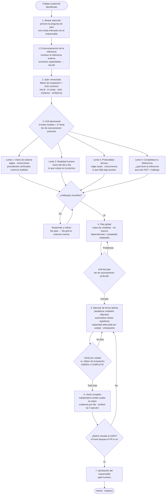

[English](README.md) | **Español**

# 🔨 Metodología Forge

[](https://github.com/davidgarciagordo/claude-code-setup-optimizer) [](https://skills.sh)  

> Una metodología disciplinada para trabajo sustancial con IA — cualquier dominio, cualquier tipo de tarea.

### 🧩 Parte de una familia — misma firma, cuatro repos

| | Repo | Rol |
|---|---|---|
| 🛠️ | [**claude-code-setup-optimizer**](https://github.com/davidgarciagordo/claude-code-setup-optimizer) | **El hub** — metodología + automatizaciones (hooks · subagents · comandos) + `/optimize-my-setup` |
| 🔨 | [**forge-methodology**](https://github.com/davidgarciagordo/forge-methodology) · *estás aquí* | Estructura *qué construir* — alinear → spec → grill ×3 → plan → verificar |
| 🎨 | [**design-review**](https://github.com/davidgarciagordo/design-review) | Pule *cómo se ve* — estructura → auditoría → anti-slop → a11y → check en vivo |
| 💸 | [**token-economy**](https://github.com/davidgarciagordo/token-economy) | Gasta *menos en hacerlo* — el principio "Token economy in multi-agent work" hecho mecanismo: context-pack (descubrir una vez), agentes read-only terse, output-style frugal, memoria pluggable. Complementa a [caveman](https://github.com/JuliusBrussee/caveman) (salida) en el eje entrada/orquestación. |

## 📦 Instalación

```bash
# 🟢 Como skill (Claude Code + 20+ agentes vía skills.sh)
npx skills add davidgarciagordo/forge-methodology

# 🔌 Como plugin de Claude Code (suelto)
/plugin marketplace add davidgarciagordo/forge-methodology
/plugin install forge-methodology@forge-methodology

# 🛠️ O todos los repos desde el hub
/plugin marketplace add davidgarciagordo/claude-code-setup-optimizer
```

---

## 🚀 Cómo se usa

**"Pásalo por la Forja"** — aplícala a cualquier trabajo sustancial; corre el loop de 7 pasos ([abajo](#el-bucle-de-un-vistazo)) en orden codificado con gates checkeados por máquina, y **te pregunta** (multi-select, recomendadas premarcadas) en los gates de **spec/grill** y **plan** — nada se ejecuta sobre una decisión que no marcaste.

```bash
# Claude Code (con el plugin working-methods) — la columna vertebral codificada, gates forzados:
/forge-run <tu tarea>

# O carga la skill directamente y sigue su loop:
#   skill: forge-methodology
```

- **Cualquier IA / sin Claude Code:** sigue [`SKILL.md`](SKILL.md) — corre cada gate en orden, es autocontenido.
- **Sáltatela en lo trivial** (one-liners, formato). Forge es para el trabajo donde equivocar el diseño sale caro.

Ejemplos resueltos → [Ejemplos](#ejemplos).

**Forge** es un flujo de trabajo con nombre propio para la colaboración persona↔IA. Estructura cualquier trabajo demasiado importante para improvisar: nuevas funcionalidades, decisiones arquitectónicas, análisis de seguridad, campañas de marketing, modelos financieros, proyectos de investigación. La versión corta: **alinear intención → descomponer la referencia → spec (con Matriz de Aceptación) → grill adversarial → plan global → ejecución optimizada → verificado → aprobación del responsable**.

> **Lo que hace que "hecho" sea mecánico (no advisory).** El fallo más caro de Forge es entregar algo que
> pasaba sus propios tests pero se quedaba corto frente al objetivo — *"Hecho contra nosotros, no contra el
> objetivo"*. La **columna vertebral de completitud mecánica** lo cierra: **nombras una referencia externa y
> enumeras sus capacidades** (Descomposición de la Referencia), que **se convierten en una Matriz de
> Aceptación** que es la Definición de Hecho canónica en el spec; una **4ª lente del grill** caza lo que
> *falta* (no solo lo que rompe); un **verificador independiente** audita cada fila (`verified-by ≠ ejecutor`);
> y un **hook bloquea abrir el PR** mientras una fila in-scope no esté trazada. **GREEN ≠ COMPLETE.** Ver
> [La columna vertebral de completitud mecánica](#la-columna-vertebral-de-completitud-mecánica).

Forge no es un proceso para todo. Las líneas sueltas y el formateo van directo. Forge es para el trabajo donde equivocarse en el diseño resulta caro — porque los agentes de IA son rápidos, y ejecutar lo incorrecto a toda velocidad es una forma eficiente de desperdiciar mucho esfuerzo.

---

## ¿Por qué Forge?

Los agentes de IA son rápidos. Esa velocidad también es un riesgo: ejecutarán lo incorrecto a fondo. Forge adelanta el pensamiento difícil para que la ejecución sea mecánica:

- La **intención alineada** detecta desajustes entre lo que se pidió y lo que realmente se necesita — antes de comenzar cualquier trabajo
- El **spec versionado** crea un contrato escrito en el que persona e IA están de acuerdo
- El **grill adversarial** detecta suposiciones erróneas antes de que queden integradas en los entregables
- El **plan global** elimina la improvisación durante la ejecución y las condiciones de carrera entre workers paralelos
- El **modelo-por-tarea** mantiene el coste proporcional a la dificultad
- El **verify continuo por unidad** detecta defectos en la fase N, no en la revisión de la fase N+10
- **Economía de tokens en trabajo multi-agente** — context pack descubierto una sola vez (cada agente recibe el mismo pack en vez de re-escanear); salida terse de los agentes (OK/KO + hallazgo de una línea); análisis read-only, mutación en una única pasada; memoria propiedad del orquestador (enchufable: claude-mem | otro | ninguno→artefacto en fichero); exploración acotada + caché de dominio evita repetir scans costosos

---

## Por qué Forge — con y sin

| | Sin Forge | Con Forge |
|---|---|---|
| **Calidad del spec** | Improvisado; suposiciones nunca validadas → se ejecuta lo incorrecto a fondo | Spec versionado + grill adversarial ×3 (visión de sistema · realidad humana · profundidad técnica) detecta suposiciones falsas con evidencia real antes de comenzar cualquier trabajo |
| **Coste y esfuerzo** | Capacidad cara para todo, incluidas las tareas triviales | Capacidad adecuada por unidad: tier rápido para lo mecánico, tier de ejecución para planes cerrados, razonamiento profundo solo para arquitectura, grill y decisiones críticas |
| **Detección de defectos** | Verify solo al final → defectos descubiertos tarde, caros de corregir | Verify por unidad contra una definición de done preestablecida → defectos detectados temprano, baratos de corregir |
| **Trabajo en paralelo** | Workers paralelos se sobreescriben entre sí; sin reglas de propiedad; falsos "todo listo" de verificaciones parciales | Grafo de propiedad + asignación de unidades de trabajo disjuntas calculadas en el plan → colisiones prevenidas antes de ejecutar |
| **Resiliencia de sesión** | Trabajo perdido cuando un límite de cuota, un corte de sesión o una interrupción ocurren a mitad de la tarea | Checkpoints por fase + cápsula de resume por workstream: el trabajo sobrevive cualquier interrupción |
| **Trabajo repetitivo** | Quemando capacidad cara de IA en tareas mecánicas (sweeps, renombrados, búsquedas, conteos) | Herramientas y scripts para trabajo determinista; IA reservada para diseño, grill y decisiones |
| **Cuello de botella en revisión** | Revisar cada entregable en serie → cuello de botella; el revisor bloquea cada siguiente paso | Revisión asíncrona por lotes: acumula entregables de varias unidades, revisa muchos de una vez |

**La diferencia medible:** menos recursos desperdiciados en trabajo mecánico, menos defectos por suposiciones no verificadas, paralelismo real sin colisiones, trabajo siempre recuperable.

---

## El bucle de un vistazo



---

## La columna vertebral de completitud mecánica

Las referencias de la metodología son razonamiento que una persona o un agente *carga*. La columna vertebral
es el conjunto de **unidades ejecutables** que hacen la completitud **mecánica en vez de advisory** — la cura
para *"lo advisory se salta / Hecho contra nosotros, no contra el objetivo."* Un solo artefacto, la
**referencia enumerada → Matriz de Aceptación**, se enhebra desde la investigación hasta el verify y se hace
cumplir en cada paso:

```
reference-decomposer ─► referencia enumerada (R1..Rn) ─► Matriz de Aceptación (DoD canónico, en el spec)
        │
        ▼
completeness-critic (4ª lente del grill, temprano)  ─► ¿cada Rn tiene fila en la matriz + owner de unidad de trabajo? bloqueante si no
        │
   …ejecutar…  (visual-fidelity-checker: comparación lado a lado por superficie de UI vs. la pantalla de la referencia = evidencia)
        │
        ▼
completeness-critic + independent-verifier (verify)  ─► cada Rn in-scope construido + evidenciado + verificado ≠ ejecutor
        │
        ▼
hooks/check-acceptance-matrix.sh  ─► BLOQUEA "declarar hecho"/`gh pr create` si la matriz no está trazada al 100%
```

| Unidad | Tipo | Qué hace cumplir |
|------|------|------------------|
| [`templates/spec-and-dod.md`](templates/spec-and-dod.md) | template | DoD = Matriz de Aceptación, **canónica en el spec**; Reference Standard enumerado, o greenfield declarado explícitamente |
| [`agents/reference-decomposer`](agents/reference-decomposer.md) | agente | referencia nombrada → lista plana enumerada de `req-id` → siembra la matriz |
| [`agents/completeness-critic`](agents/completeness-critic.md) | agente | la **4ª lente del grill**: una capacidad de la referencia ausente del spec/plan es un hallazgo **bloqueante** (corre temprano *y* en el verify) |
| [`agents/independent-verifier`](agents/independent-verifier.md) | agente | auditoría fila a fila de la matriz; evidencia real por fila; `verified-by ≠ ejecutor` |
| [`agents/visual-fidelity-checker`](agents/visual-fidelity-checker.md) | agente | comparación lado a lado por superficie de UI vs. la pantalla de la referencia — fidelidad **externa**, distinta de la paridad interna claro/oscuro |
| [`hooks/check-acceptance-matrix.sh`](hooks/check-acceptance-matrix.sh) | hook | **bloquea** "declarar hecho"/`gh pr create` mientras cualquier fila in-scope carezca de `built` + evidencia + `verified-by` independiente |
| `Satisfies-reqs` (campo del plan) | campo | cada `req-id` in-scope tiene una unidad de trabajo dueña — ninguna capacidad de la referencia queda sin planificar |

**GREEN ≠ COMPLETE.** GREEN = los tests que existen pasan sobre lo construido. COMPLETE = cada requisito
in-scope de la referencia está trazado a evidencia y verificado de forma independiente. Una fase está hecha
solo si es COMPLETE. Mapas completos: [`agents/README.md`](agents/README.md) · [`hooks/README.md`](hooks/README.md).

---

## Cómo se adapta a tu dominio

El bucle central (los 7 pasos anteriores) es agnóstico de dominio. Los **packs de dominio** lo instancian con lentes de grill, definiciones de done y pasos de verificación específicos del dominio:

| Dominio | Pack |
|---------|------|
| Software — backend, APIs, datos | [references/domain-packs/software-backend.md](references/domain-packs/software-backend.md) |
| Software — frontend, UI, sistema de diseño | [references/domain-packs/software-frontend.md](references/domain-packs/software-frontend.md) |
| Software — orquestación multi-agente | [references/domain-packs/software-agents.md](references/domain-packs/software-agents.md) |
| Seguridad, modelado de amenazas | [references/domain-packs/security.md](references/domain-packs/security.md) |
| Diseño de producto, UX/UI | [references/domain-packs/design.md](references/domain-packs/design.md) |
| Brainstorming, estrategia | [references/domain-packs/brainstorming.md](references/domain-packs/brainstorming.md) |
| Marketing, campañas, go-to-market | [references/domain-packs/marketing.md](references/domain-packs/marketing.md) |
| Modelado financiero y análisis | [references/domain-packs/finance.md](references/domain-packs/finance.md) |

Para dominios sin pack: deriva tres lentes usando el patrón visión de sistema · realidad humana · profundidad técnica de [references/grill.md](references/grill.md), y define la definición de done del dominio antes de comenzar.

---

## Ejemplos

Prompts reales listos para copiar en 8 dominios, con lo que Forge produce en cada caso:

→ [examples/](examples/README.es.md)

---

## Referencias

| Referencia | Contenido |
|------------|-----------|
| [references/the-loop.md](references/the-loop.md) | Bucle universal completo de 7 pasos |
| [references/grill.md](references/grill.md) | Método de grill adversarial + gates interactivos (entrada → ×3 → gate de usuario → re-grill informado) + tabla de lentes por dominio |
| [references/planning.md](references/planning.md) | Estructura del plan global + modelo de propiedad de unidades de trabajo |
| [references/execution-modes.md](references/execution-modes.md) | Cómo paralelizar, automatizar, tierar y hacer checkpoints |
| [references/verification.md](references/verification.md) | Definición de done + reglas de evidencia + ejemplos por dominio |
| [references/model-routing.md](references/model-routing.md) | Routing de tiers de capacidad (vendor-neutral + ejemplo de mapeo) |
| [agents/](agents/README.md) | La columna vertebral ejecutable: `reference-decomposer`, `completeness-critic`, `independent-verifier`, `visual-fidelity-checker` |
| [hooks/](hooks/README.md) | El hook de enforcement: bloquea "declarar hecho"/PR sobre una Matriz de Aceptación incompleta |
| [templates/spec-and-dod.md](templates/spec-and-dod.md) | Spec con Reference Standard + Matriz de Aceptación (el DoD canónico) |
| [skills/](skills/README.md) | Skills grill compañeras incluidas (`grill-me`, `grill-with-docs`) — la forma interactiva del grill |

---

## Instalación

### Como skill de Claude Code (recomendado)

```bash
git clone https://github.com/davidgarciagordo/forge-methodology ~/.claude/skills/forge-methodology
```

Claude Code detecta el skill automáticamente. Invócalo con la herramienta `Skill` usando `skill: "forge-methodology"`.

### Como regla de proyecto

Copia `SKILL.md` en el directorio de reglas de tu proyecto:

```bash
cp ~/.claude/skills/forge-methodology/SKILL.md ~/.claude/rules/forge-methodology.md
```

O copia directamente desde este repo:

```bash
curl -o ~/.claude/rules/forge-methodology.md \
  https://raw.githubusercontent.com/davidgarciagordo/forge-methodology/main/SKILL.md
```

### Sin Claude Code

Lee `SKILL.md` y el pack de dominio correspondiente. La metodología funciona con cualquier asistente de IA o como proceso de equipo humano — no requiere herramientas específicas.

---

## Licencia

MIT — ver [LICENSE](./LICENSE).

---
<sub>Hecho por [David García Gordo](https://github.com/davidgarciagordo) · MIT · parte de la familia [claude-code-setup-optimizer](https://github.com/davidgarciagordo/claude-code-setup-optimizer)</sub>
