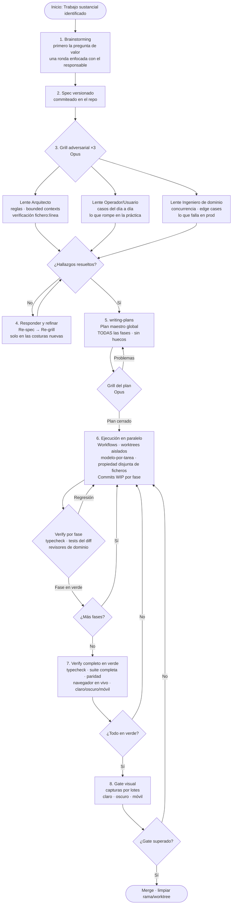

[English](README.md) | **Español**

# Metodología Forge

> Un pipeline disciplinado para trabajo de software sustancial con agentes de IA.

**Forge** es un flujo de trabajo con nombre propio para la ingeniería de software asistida por IA. Estructura el trabajo demasiado importante para improvisar: nuevas funcionalidades, cambios arquitectónicos, refactorizaciones grandes y migraciones. La versión corta: **spec → grill adversarial → plan global → ejecución en paralelo → verify en verde → gate visual**.

Forge no es un proceso para todo. Las líneas sueltas y el formateo van directo. Forge es para el trabajo donde equivocarse en el diseño resulta caro.

---

## ¿Por qué Forge?

Los agentes de IA son rápidos. Esa velocidad también es un riesgo: implementarán lo incorrecto a fondo. Forge adelanta el pensamiento difícil para que la ejecución sea mecánica:

- El **grill adversarial** detecta suposiciones erróneas antes de escribir código
- El **plan maestro global** elimina la improvisación durante la ejecución
- El **modelo-por-tarea** mantiene el coste proporcional a la dificultad
- El **verify continuo por fase** detecta regresiones en la fase N, no en el PR de la fase N+10
- Las **reglas duras de multi-worker** previenen condiciones de carrera entre agentes paralelos

---

## Por qué Forge — con y sin

| | Sin Forge | Con Forge |
|---|---|---|
| **Calidad del spec** | Specs improvisados; suposiciones nunca verificadas contra el código real → se construye lo incorrecto a fondo | Spec versionado + grill adversarial ×3 (Arquitecto · Operador · Ingeniero de dominio) detecta suposiciones falsas con evidencia `fichero:línea` antes de escribir una línea de código |
| **Coste** | Un modelo caro (Opus) para todo, incluidas las tareas triviales | Modelo-por-tarea: Haiku para trabajo mecánico, Sonnet para ejecutar planes cerrados, Opus solo para arquitectura, grill y revisión crítica |
| **Detección de regresiones** | Verify al final de la funcionalidad completa → regresiones descubiertas en el PR de la fase N+10, costosas de corregir | Verify barato en paralelo tras cada commit de fase (typecheck + tests del diff + revisores de dominio) → regresión detectada en la fase N |
| **Agentes en paralelo** | Los agentes se sobreescriben ficheros entre sí; sin reglas de propiedad; falsos "todo verde" de ejecuciones parciales de tests | Grafo de propiedad de ficheros + 1 worktree = 1 worker = 1 rama: las colisiones se calculan y previenen en el plan antes de ejecutar |
| **Resiliencia de sesión** | Trabajo perdido cuando un límite de cuota o un fallo ocurre a mitad de una funcionalidad | Commits WIP por subfase + cápsula de resume `state.md` por workstream: el trabajo sobrevive cualquier límite de sesión |
| **Trabajo repetitivo** | Quemando tokens iterando en tareas mecánicas (sweeps, renombrados, conteos) que un script haría en milisegundos | Regla scripts-antes-que-tokens: bash/python/`grep`/`jq` para trabajo determinista; tokens reservados para diseño, grill y decisiones |
| **Revisión visual** | Captura por PR → cuello de botella serial; el revisor bloquea cada merge | Gate visual por lotes: acumula todas las capturas de superficies (claro/oscuro/móvil) en una cola asíncrona; revisar muchas a la vez |

**La diferencia medible:** menos tokens desperdiciados en trabajo mecánico, menos bugs en producción por suposiciones no verificadas, paralelismo real sin colisiones y trabajo siempre recuperable.

---

## El pipeline de un vistazo



---

## Capa de ejecución y orquestación (8 reglas)

Forge diseña bien. Estas reglas optimizan el **coste y la fiabilidad** en la ejecución multi-agente paralela.

| # | Regla | Punto clave |
|---|-------|-------------|
| 1 | **Scheduling por cuota + tier** | Construye un ledger de cuentas antes de ejecutar. Trabajo más pesado → tier más alto. Checkpoint preventivo al ~80% de la ventana, nunca reactivo. Mantén una cuenta en reserva. |
| 2 | **Grafo de propiedad de ficheros** | Cada fase declara los ficheros que escribe y de los que depende. Calcula el schedule paralelizable; detecta ficheros cross-cutting de antemano y asigna un único integrador. |
| 3 | **Verify continuo por fase** | Cada commit de fase dispara un verify barato en paralelo (typecheck + tests del diff + revisores de dominio). Captura regresiones en la fase N, no en la fase N+10. |
| 4 | **Grill adaptativo por tier** | Profundidad de grill ∝ novedad × radio de impacto. Primera pasada en Sonnet; escala a Opus solo para hallazgos disputados o arquitectónicos. |
| 5 | **Orquestador barato** | Coordinación rutinaria = scripteado/Haiku/monitor. Opus solo para rebalanceo, arbitraje, grill y revisión crítica. |
| 6 | **Cápsula de resume + commits WIP** | Cada workstream mantiene un `state.md` commiteado. Commits WIP por subfase evitan perder trabajo cuando se alcanza un límite de sesión. |
| 7 | **Gate visual por lotes + stories** | Todos los componentes UI tienen stories. Acumula todas las capturas de superficies en una cola de gate; revisa muchas a la vez en lugar de bloquear por PR. |
| 8 | **Granularidad de fase** | Cada fase ≤ 1 commit revisable / ~1-2h. Marca en el plan qué fases son paralelizables vs. seriales (derivado del grafo de propiedad de ficheros). |

### Reglas duras de multi-worker

- **1 worktree = 1 worker = 1 rama** — sin excepciones.
- Verifica que un worker está muerto por **PID y prompt real**, no con un `grep | wc` ingenuo.
- Mata todo el árbol de procesos (shell padre + proceso del agente + cualquier subproceso de build).
- Lanza en modo headless con `--permission-mode acceptEdits` + allowlist explícita de herramientas. **Nunca `--dangerously-skip-permissions`.**
- **Cero recursos de infra facturables** sin aprobación explícita.

---

## Principios transversales

### ⭐ Modelo por tarea (el control de coste más importante)

| Modelo | Usar para |
|--------|-----------|
| **Haiku** | Trivial / mecánico: líneas sueltas, formateo, stubs |
| **Sonnet** | Ejecutar planes cerrados, refactors, migraciones, volumen |
| **Opus** | Arquitectura, grill adversarial, arbitraje, revisión crítica |

Nada de Opus donde Sonnet rinde igual. Aplica a cada agente, incluido el orquestador.

### ⭐ Scripts antes que tokens

Trabajo repetitivo/mecánico/de alto volumen → escribe un script bash/python o usa `grep`/`rg`/`sed`/`jq`. Determinista, rápido y barato. Reserva los tokens para diseño, grill y decisiones.

### Reuse-first en todas las capas

Crea primitivas reutilizables antes de duplicar lógica. Preocupaciones transversales (auth, API fetch, logging, errores, i18n) → un único punto central. El reuso es parte del diseño, no un afterthought.

---

## Instalación

### Como skill de Claude Code (recomendado)

```bash
git clone https://github.com/davidgarciagordo/forge-methodology ~/.claude/skills/forge-methodology
```

Claude Code detectará el skill automáticamente. Invócalo con la herramienta `Skill` usando `skill: "forge-methodology"`.

### Como regla de proyecto

Copia `SKILL.md` en el directorio de reglas de tu proyecto:

```bash
cp ~/.claude/skills/forge-methodology/SKILL.md ~/.claude/rules/forge-methodology.md
```

O copia directamente desde este repo:

```bash
curl -o ~/.claude/rules/forge-methodology.md \
  https://raw.githubusercontent.com/davidgarciagordo/forge-methodology/main/SKILL.md
```

---

## Licencia

MIT — ver [LICENSE](./LICENSE).
