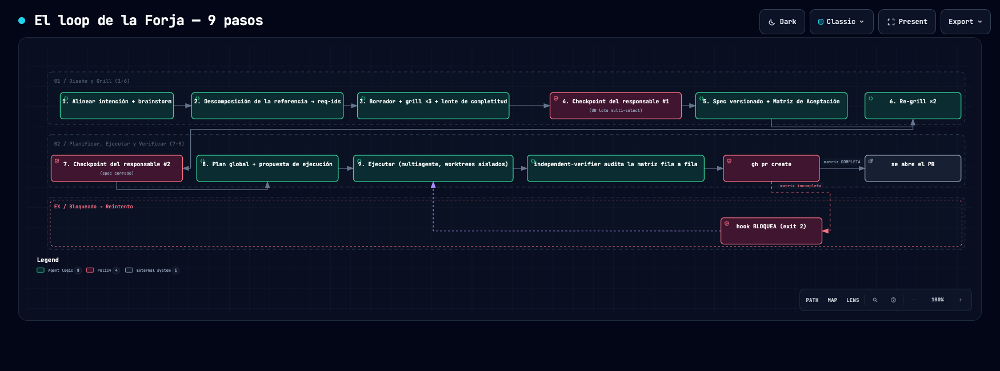

[English](README.md) | **Español**

# 🔥 forge-methodology

El trabajo asistido por IA falla de dos maneras que se repiten, y ambas parecen éxito hasta que alguien lo comprueba. **"Done against ourselves, not against the goal"** (hecho contra nosotros mismos, no contra el objetivo): el trabajo se mide contra la checklist del propio ejecutor en vez de contra aquello a lo que debía equipararse — un proyecto "paridad con X" sale con la mitad de X porque nadie enumeró nunca qué hace X. Y **"self-verified-green"** (verde auto-verificado): el mismo agente que lo construyó lo declara verificado, y unos tests verdes sobre *lo que existe* se confunden con un resultado completo. Forge es una metodología humano↔IA de 9 pasos (plugin de Claude Code) que convierte ambos fallos de advertencia en **código**: la referencia externa se enumera en una **Matriz de Aceptación** — un `req-id` por capacidad — y un hook **bloquea `gh pr create`** mientras cualquier fila in-scope carezca de evidencia real o de un verificador independiente. La completitud deja de ser una promesa y pasa a ser un exit code.

## 📦 Instalación

Solo este plugin:

```bash
/plugin marketplace add davidgarciagordo/forge-methodology
/plugin install forge-methodology@forge-methodology
```

O toda la suite (este + design-review, token-economy, working-methods, automations, swarm) desde [un único catálogo](https://github.com/davidgarciagordo/claude-plugins):

```bash
/plugin marketplace add davidgarciagordo/claude-plugins
/plugin install forge-methodology@davidgarciagordo-plugins
```

## 🚀 Quick start

1. Instala (arriba) y di **"forja esto: webhooks de pago idempotentes, paridad con la spec de webhooks de Stripe"** — el loop corre, preguntándote en exactamente **dos checkpoints** (lotes multi-select con recomendaciones premarcadas).
2. El paso 2 enumera la referencia en `req-id`s; la **Matriz de Aceptación** del spec se convierte en la Definition of Done:

   | req-id | source (ref §/screen) | in-scope? | built? | evidence (test/screenshot/link) | verified-by (≠ executor) |
   |--------|----------------------|-----------|--------|---------------------------------|--------------------------|
   | R1 | Stripe docs §retries | yes | yes | `tests/webhooks.retry.test.ts` | independent-verifier |
   | R2 | Stripe docs §signatures | yes | yes | — | — |
   | R3 | Stripe docs §event-types | yes | no | — | — |
   | R4 | Stripe docs §thin-payloads | no | — | (out of scope — see Non-goals) | — |

3. Declara hecho antes de tiempo — el hook intercepta `gh pr create` y bloquea (exit 2), con esta salida real:

   ```
   FORGE BLOCK — Acceptance Matrix is not COMPLETE. Cannot declare done / open PR.
   GREEN (tests pass on what exists) ≠ COMPLETE (every in-scope requirement traced to evidence + independently verified).
   Incomplete in-scope rows:
     [.forge/spec.md] R2 -> no-evidence no-verified-by
     [.forge/spec.md] R3 -> built≠yes no-evidence no-verified-by
   ```

4. Construye R3 y corre `/forge-verify-matrix` (o el agente `independent-verifier`) para rellenar evidencia + un `verified-by` independiente en R2 y R3.
5. `gh pr create` de nuevo → `forge: Acceptance Matrix COMPLETE — all in-scope rows built + evidenced + independently verified.`

> **Qué garantiza el hook y qué no.** Es un guardarraíl `PreToolUse` sobre el `gh pr create` del propio agente (más los marcadores opt-in `[forge-done]` / `FORGE_DONE=1`). Impide que el *agente* declare hecho antes de tiempo; **no** es branch protection de servidor — un humano que pushea y mergea desde la web lo esquiva. Para un gate de servidor, corre el mismo script en CI ([hooks/README.md](hooks/README.md) muestra la invocación). **Además es fail-open por defecto**: si no encuentra ninguna Matriz de Aceptación, imprime un aviso y **no** bloquea — puede que el repo simplemente no use Forge para esa PR. Pon `FORGE_REQUIRE_MATRIX=1` si quieres que una matriz ausente también bloquee.

## 🧩 Qué trae la caja

| Componente | Tipo | Qué hace | Invocación |
|---|---|---|---|
| [`forge-methodology`](SKILL.md) | skill | El loop de 9 pasos: intención → referencia → spec grillado → plan → done verificado | di **"forja esto"** / **"pásalo por la Forja"**, o `skill: "forge-methodology"` |
| [`grill-me`](skills/grill-me/SKILL.md) | skill | Interview adversarial standalone sobre cualquier plan — 3 pasadas, un lote de decisiones, pasada informada | di **"grill me"**, o `skill: "grill-me"` |
| [`grill-with-docs`](skills/grill-with-docs/SKILL.md) | skill | El mismo grill, pero desafía el plan contra `CONTEXT.md`/ADRs y actualiza la doc inline | `skill: "grill-with-docs"` |
| [`reference-decomposer`](agents/reference-decomposer.md) | agente (tier ejecución) | Convierte una referencia con nombre en la lista enumerada de `req-id`s que siembra la matriz | subagente — paso 2 del loop |
| [`completeness-critic`](agents/completeness-critic.md) | agente (tier profundo) | 4ª lente del grill: caza lo que **falta** vs la referencia (ausencia = bloqueante) | subagente — pasos 3 y 9 |
| [`independent-verifier`](agents/independent-verifier.md) | agente (tier profundo) | Auditoría de la matriz fila a fila: evidencia real por fila, `verified-by ≠ executor` | subagente — paso 9 |
| [`visual-fidelity-checker`](agents/visual-fidelity-checker.md) | agente (tier ejecución) | Side-by-side de cada superficie UI construida vs la pantalla equivalente de la referencia | subagente — filas UI |
| [`/forge-verify-matrix`](skills/forge-verify-matrix/SKILL.md) | skill (invocación manual) | Ejecución manual del gate de completitud + los dos agentes de verify | `/forge-verify-matrix` |
| [`check-acceptance-matrix.sh`](hooks/check-acceptance-matrix.sh) | hook (`PreToolUse` sobre Bash) | Bloquea `gh pr create` / `[forge-done]` mientras cualquier fila in-scope esté sin trazar | automático al instalar |
| [templates/](templates/) | 4 plantillas | [spec-and-dod](templates/spec-and-dod.md) (la matriz), [work-unit-plan](templates/work-unit-plan.md) (`Satisfies-reqs`), [state-capsule](templates/state-capsule.md), [phase-gate-checklist](templates/phase-gate-checklist.md) | copia a tu repo |
| [references/](references/) | 7 docs + 8 domain packs | [the-loop](references/the-loop.md), [grill](references/grill.md), [planning](references/planning.md), [execution-modes](references/execution-modes.md), [model-routing](references/model-routing.md), [verification](references/verification.md), [agents-overview](references/agents-overview.md) | los carga la skill |
| [examples/](examples/README.es.md) | ejemplos | 8 prompts end-to-end copy-paste por dominios | copy-paste |

## ⚙️ Cómo funciona — el loop de 9 pasos

[](docs/diagrams/forge-loop.es.html)

*Versión interactiva: docs/diagrams/forge-loop.es.html (ábrelo en local)*

1. **Alinear intención + brainstorm** — primero la pregunta de valor; espacio de opciones real (2-3 enfoques), una ronda enfocada con el responsable.
2. **Descomposición de la referencia** — nombra una referencia externa, enumera sus capacidades en `req-id`s.
3. **Borrador + grill ×3** — el enfoque elegido como borrador concreto, atacado por 3 lentes hostiles + la 4ª lente de Completitud vs Referencia (grillar el borrador cuando cambiar es barato).
4. **Checkpoint del responsable #1** — UN lote multi-select: cada decisión que el grill destapó, recomendaciones premarcadas.
5. **Spec versionado** — borrador + veredictos + tus decisiones se convierten en el spec; los `req-id`s en la Matriz de Aceptación, el DoD canónico.
6. **Re-grill ×2** — ¿aguantan los fixes? + atacar las costuras nuevas que los fixes crearon.
7. **Checkpoint del responsable #2** — UN lote multi-select; tras él el spec queda cerrado.
8. **Plan global + propuesta de ejecución** — todas las unidades, sin huecos, dependencias mapeadas, specs por fase escritos; cierra proponiendo la ejecución más efectiva (multiagente por defecto: worktrees aislados, un context-pack compartido, modelo por unidad).
9. **Ejecutar → verify → aprobación** — `independent-verifier` audita la matriz fila a fila (`verified-by ≠ ejecutor`); el hook bloquea "declarar hecho"/`gh pr create` mientras una fila in-scope no esté trazada. **GREEN ≠ COMPLETE.**

Los **domain packs** instancian el loop con lentes y criterios de done por dominio — 8 packs: [software-backend](references/domain-packs/software-backend.md) · [software-frontend](references/domain-packs/software-frontend.md) · [software-agents](references/domain-packs/software-agents.md) · [security](references/domain-packs/security.md) · [design](references/domain-packs/design.md) · [brainstorming](references/domain-packs/brainstorming.md) · [marketing](references/domain-packs/marketing.md) · [finance](references/domain-packs/finance.md).

**Míralo aplicado → [examples/](examples/README.es.md)**: 8 prompts end-to-end (feature de backend, rediseño de UI, auditoría de seguridad, decisión de producto, campaña de marketing, modelo financiero, migración zero-downtime, evaluación de vendors), cada uno con las lentes que disparan y qué aspecto tiene "done".

Detalle completo: [SKILL.md](SKILL.md), [references/the-loop.md](references/the-loop.md), [references/grill.md](references/grill.md), [references/agents-overview.md](references/agents-overview.md), [hooks/README.md](hooks/README.md).

## 📖 Glosario

- **Grill** — pasada de revisión adversarial: lentes hostiles independientes atacan un borrador o spec para romperlo mientras cambiarlo aún es barato.
- **Lente** — una perspectiva del grill con su propia hipótesis de fallo (p. ej. arquitecto de plataforma · operador real · ingeniero del dominio); la 4ª lente fija caza lo que *falta*, no lo que rompe.
- **Matriz de Aceptación / req-id** — la referencia enumerada como tabla, un `req-id` estable por capacidad; el único artefacto que se hila research → spec → plan → verify, y la tabla que parsea el hook.
- **DoD (Definition of Done)** — cada fila in-scope de la matriz con `built = yes` + evidencia comprobable + `verified-by` independiente; fijado canónicamente en el spec, nunca diferido al plan ni al sign-off.
- **GREEN ≠ COMPLETE** — GREEN = los tests que existen pasan sobre lo construido; COMPLETE = cada requisito in-scope de la referencia trazado a evidencia y verificado de forma independiente. Solo COMPLETE es done.
- **State capsule** — el artefacto de reanudación por workstream ([plantilla](templates/state-capsule.md)) para que el trabajo sobreviva a sesiones, cuotas e interrupciones.

## 🚫 Cuándo NO usarla

**El trigger es diseño vs ejecución, no número de ficheros.** Ve directo — sin Forge — cuando el trabajo es *ejecutar algo ya decidido*: un bug fix, un sweep o migración mecánica, aplicar un plan escrito o los hallazgos de una review (aunque toque muchos ficheros), o un único edit reversible. Usa Forge cuando el trabajo necesita una decisión de diseño cara de equivocar: paridad con una referencia con nombre, una feature/producto/integración nueva, una decisión de arquitectura o seguridad, un contrato de comportamiento del que dependen otros.

Coste honesto: una pasada completa gasta **4+ pasadas de tier de razonamiento profundo antes de ejecutar nada** (grill ×3 + lente de completitud, re-grill ×2, grill del plan, verify independiente). Por debajo de cierto tamaño de trabajo la metodología cuesta más que el error que evita — para eso está el trigger de arriba. Cuenta decisiones, no ficheros.

## ❓ ¿`/forge-run`?

`/forge-run <tarea>` — el runner totalmente codificado con gates de fase machine-checked — **no está en este plugin**; viene en el plugin aparte [`working-methods`](https://github.com/davidgarciagordo/claude-code-setup-optimizer) (mismo catálogo). En standalone, este plugin te da la skill de la metodología (se dispara con "forja esto"), las dos skills de grill, los 4 agentes, la skill de invocación manual `/forge-verify-matrix` y el hook de la Matriz de Aceptación.

## 🔀 Alternativas

- **git clone como skill** (método más antiguo, previo a los plugins): `git clone https://github.com/davidgarciagordo/forge-methodology ~/.claude/skills/forge-methodology`.
- **Como regla de usuario** — si quieres Forge como regla estilo CLAUDE.md en vez de skill invocada, copia `SKILL.md` a tu directorio de reglas de usuario: `cp SKILL.md ~/.claude/rules/forge-methodology.md` (o a `.claude/rules/` para un solo proyecto).

## ⚖️ Licencia

MIT © David García Gordo
