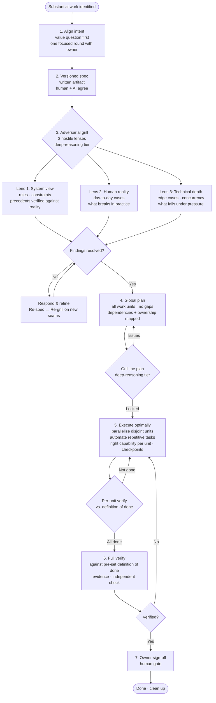

**English** | [Español](README.es.md)

# Forge Methodology

> A disciplined methodology for substantial work with AI — any domain, any task type.

**Forge** is a named workflow for human↔AI collaboration. It structures any work that is too important to improvise: new product features, architectural decisions, security assessments, marketing campaigns, financial analyses, research projects. The short version: **align intent → spec → adversarial grill → global plan → optimal execution → verified done → owner sign-off**.

Forge is not a process for everything. One-liners and formatting go direct. Forge is for the work where getting the design wrong is expensive — because AI agents are fast, and fast execution of the wrong thing is a reliable way to waste a lot of effort.

---

## Why Forge?

AI agents are fast. That speed is also a risk: they will execute the wrong thing thoroughly. Forge front-loads the hard thinking so execution becomes mechanical:

- **Aligned intent** surfaces misalignments between what was asked and what is actually needed — before any work begins
- **Versioned spec** creates a written contract both human and AI agree on
- **Adversarial grill** catches wrong assumptions before they are baked into deliverables
- **Global plan** eliminates mid-flight improvisation and race conditions between parallel workers
- **Model-per-task** keeps cost proportional to difficulty
- **Continuous per-unit verification** catches defects at phase N, not in the review at phase N+10

---

## Why Forge — with vs. without

| | Without Forge | With Forge |
|---|---|---|
| **Spec quality** | Improvised; assumptions never validated → wrong thing executed thoroughly | Versioned spec + adversarial grill ×3 (system view · human reality · technical depth) catches false assumptions with real evidence before any work begins |
| **Cost and effort** | Expensive capability for everything, including trivial tasks | Right capability per unit: fast tier for mechanical, execution tier for closed plans, deep-reasoning only for architecture, grill, and critical decisions |
| **Defect detection** | Verify only at the end → defects discovered late, expensive to fix | Per-unit verify against a pre-set definition of done → defects caught early, cheap to fix |
| **Parallel work** | Parallel workers overwrite each other; no ownership rules; false "all done" from partial checks | Ownership graph + disjoint work unit assignment computed at plan time → collisions prevented before execution starts |
| **Session resilience** | Work lost when a quota limit, session boundary, or interruption hits mid-task | Per-phase checkpoints + resume capsule per workstream: work survives any interruption |
| **Repetitive work** | Burning expensive AI capability on mechanical tasks (sweeps, renames, searches, counts) | Tools and scripts for deterministic work; AI reserved for design, grill, and decisions |
| **Review bottleneck** | Review every output serially → bottleneck; reviewer blocks every next step | Batched async review: accumulate outputs across units, review many at once |

**The measurable difference:** fewer resources wasted on mechanical work, fewer defects from unverified assumptions, real parallelism without collisions, work that is always recoverable.

---

## The Loop at a Glance



---

## How It Adapts to Your Domain

The core loop (the 7 steps above) is domain-agnostic. **Domain packs** instantiate it with domain-specific grill lenses, definitions of done, and verification steps:

| Domain | Pack |
|--------|------|
| Software — backend, APIs, data | [references/domain-packs/software-backend.md](references/domain-packs/software-backend.md) |
| Software — frontend, UI, design system | [references/domain-packs/software-frontend.md](references/domain-packs/software-frontend.md) |
| Software — multi-agent orchestration | [references/domain-packs/software-agents.md](references/domain-packs/software-agents.md) |
| Security assessment, threat modeling | [references/domain-packs/security.md](references/domain-packs/security.md) |
| Product design, UX/UI | [references/domain-packs/design.md](references/domain-packs/design.md) |
| Brainstorming, strategy | [references/domain-packs/brainstorming.md](references/domain-packs/brainstorming.md) |
| Marketing, campaigns, go-to-market | [references/domain-packs/marketing.md](references/domain-packs/marketing.md) |
| Financial modeling and analysis | [references/domain-packs/finance.md](references/domain-packs/finance.md) |

For domains not yet covered: derive three lenses using the system view · human reality · technical depth pattern in [references/grill.md](references/grill.md), and define the domain's definition of done before starting.

---

## Examples

Real copy-paste prompts across 8 domains, with what Forge produces for each:

→ [examples/](examples/README.md)

---

## References

| Reference | Contents |
|-----------|----------|
| [references/the-loop.md](references/the-loop.md) | Full 7-step universal loop |
| [references/grill.md](references/grill.md) | Adversarial grill method + lens table by domain |
| [references/planning.md](references/planning.md) | Global plan structure + work-unit ownership model |
| [references/execution-modes.md](references/execution-modes.md) | How to parallelise, automate, tier, and checkpoint |
| [references/verification.md](references/verification.md) | Definition of done + evidence rules + domain examples |
| [references/model-routing.md](references/model-routing.md) | Capability tier routing (vendor-neutral + example mapping) |

---

## Installation

### As a Claude Code Skill (recommended)

```bash
git clone https://github.com/davidgarciagordo/forge-methodology ~/.claude/skills/forge-methodology
```

Claude Code picks up the skill automatically. Invoke it with the `Skill` tool using `skill: "forge-methodology"`.

### As a Project Rule

Copy `SKILL.md` into your project's rules directory:

```bash
cp ~/.claude/skills/forge-methodology/SKILL.md ~/.claude/rules/forge-methodology.md
```

Or copy directly from this repo:

```bash
curl -o ~/.claude/rules/forge-methodology.md \
  https://raw.githubusercontent.com/davidgarciagordo/forge-methodology/main/SKILL.md
```

### Without Claude Code

Read `SKILL.md` and the relevant domain pack. The methodology works with any AI assistant or as a human team process — no tooling required.

---

## License

MIT — see [LICENSE](./LICENSE).
