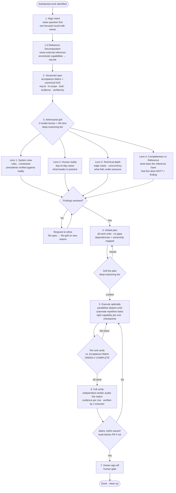

**English** | [Español](README.es.md)

# 🔨 Forge Methodology

[](https://github.com/davidgarciagordo/claude-code-setup-optimizer) [](https://skills.sh)  

> A disciplined methodology for substantial work with AI — any domain, any task type.

### 🧩 Part of a family — same signature, three repos

| | Repo | Role |
|---|---|---|
| 🛠️ | [**claude-code-setup-optimizer**](https://github.com/davidgarciagordo/claude-code-setup-optimizer) | **The hub** — methodology + automations (hooks · subagents · commands) + `/optimize-my-setup` |
| 🔨 | [**forge-methodology**](https://github.com/davidgarciagordo/forge-methodology) · *you are here* | Structure *what to build* — align → spec → grill ×3 → plan → verify |
| 🎨 | [**design-review**](https://github.com/davidgarciagordo/design-review) | Polish *how it looks* — structure → audit → anti-slop → a11y → live check |

**Forge** is a named workflow for human↔AI collaboration. It structures any work that is too important to improvise: new product features, architectural decisions, security assessments, marketing campaigns, financial analyses, research projects. The short version: **align intent → decompose the reference → spec (with an Acceptance Matrix) → adversarial grill → global plan → optimal execution → verified done → owner sign-off**.

> **What makes "done" mechanical (not advisory).** Forge's hardest failure is shipping something that passed
> its own tests but fell short of the goal — *"Done against ourselves, not against the goal."* The
> **Mechanical Completeness Spine** closes that: you **name an external reference and enumerate its
> capabilities** (Reference Decomposition), they **become an Acceptance Matrix** that is the canonical
> Definition of Done in the spec, a **fourth grill lens** hunts what's *missing* (not just what breaks), an
> **independent verifier** audits every matrix row (`verified-by ≠ executor`), and a **hook blocks opening a
> PR** while any in-scope row is untraced. **GREEN ≠ COMPLETE.** See [The Mechanical Completeness Spine](#the-mechanical-completeness-spine).

Forge is not a process for everything. One-liners and formatting go direct. Forge is for the work where getting the design wrong is expensive — because AI agents are fast, and fast execution of the wrong thing is a reliable way to waste a lot of effort.

## 📦 Install

```bash
# 🟢 As a skill (Claude Code + 20+ agents via skills.sh)
npx skills add davidgarciagordo/forge-methodology

# 🔌 As a standalone Claude Code plugin
/plugin marketplace add davidgarciagordo/forge-methodology
/plugin install forge-methodology@forge-methodology

# 🛠️ Or get all three repos from the hub
/plugin marketplace add davidgarciagordo/claude-code-setup-optimizer
```

More ways (git clone, project rule, no-Claude-Code) → [Installation](#installation) below.

---

## Why Forge?

AI agents are fast. That speed is also a risk: they will execute the wrong thing thoroughly. Forge front-loads the hard thinking so execution becomes mechanical:

- **Aligned intent** surfaces misalignments between what was asked and what is actually needed — before any work begins
- **Versioned spec** creates a written contract both human and AI agree on
- **Adversarial grill** catches wrong assumptions before they are baked into deliverables
- **Global plan** eliminates mid-flight improvisation and race conditions between parallel workers
- **Model-per-task** keeps cost proportional to difficulty
- **Continuous per-unit verification** catches defects at phase N, not in the review at phase N+10
- **Token economy in multi-agent work** — discover-once context pack (each agent receives the same pack rather than re-scanning); terse agent output (OK/KO + 1-line findings); read-only analysis, mutate in one pass; memory orchestrator-owned (pluggable: claude-mem | other | none→file artifact); capped exploration + domain cache avoids re-running expensive scans

---

## Why Forge — with vs. without

| | Without Forge | With Forge |
|---|---|---|
| **Spec quality** | Improvised; assumptions never validated → wrong thing executed thoroughly | Versioned spec + adversarial grill ×3 (system view · human reality · technical depth) catches false assumptions with real evidence before any work begins |
| **Cost and effort** | Expensive capability for everything, including trivial tasks | Right capability per unit: fast tier for mechanical, execution tier for closed plans, deep-reasoning only for architecture, grill, and critical decisions |
| **Defect detection** | Verify only at the end → defects discovered late, expensive to fix | Per-unit verify against a pre-set definition of done → defects caught early, cheap to fix |
| **Parallel work** | Parallel workers overwrite each other; no ownership rules; false "all done" from partial checks | Ownership graph + disjoint work unit assignment computed at plan time → collisions prevented before execution starts |
| **Session resilience** | Work lost when a quota limit, session boundary, or interruption hits mid-task | Per-phase checkpoints + resume capsule per workstream: work survives any interruption |
| **Repetitive work** | Burning expensive AI capability on mechanical tasks (sweeps, renames, searches, counts) | Tools and scripts for deterministic work; AI reserved for design, grill, and decisions |
| **Review bottleneck** | Review every output serially → bottleneck; reviewer blocks every next step | Batched async review: accumulate outputs across units, review many at once |

**The measurable difference:** fewer resources wasted on mechanical work, fewer defects from unverified assumptions, real parallelism without collisions, work that is always recoverable.

---

## The Loop at a Glance



---

## The Mechanical Completeness Spine

The methodology references are reasoning a human or agent *loads*. The spine is the set of **executable
units** that make completeness **mechanical instead of advisory** — the cure for *"the advisory gets skipped
/ Done against ourselves, not against the goal."* One artifact, the **enumerated reference → Acceptance
Matrix**, is threaded from research to verify and enforced at each step:

```
reference-decomposer ─► enumerated reference (R1..Rn) ─► Acceptance Matrix (canonical DoD, in the spec)
        │
        ▼
completeness-critic (4th grill lens, early)  ─► every Rn has a matrix row + a work-unit owner? blocking if not
        │
   …execute…  (visual-fidelity-checker: per-UI-surface side-by-side vs the reference's screen = evidence)
        │
        ▼
completeness-critic + independent-verifier (verify)  ─► every in-scope Rn built + evidenced + verified ≠ executor
        │
        ▼
hooks/check-acceptance-matrix.sh  ─► BLOCKS "declare done"/`gh pr create` if the matrix isn't 100% traced
```

| Unit | Kind | What it enforces |
|------|------|------------------|
| [`templates/spec-and-dod.md`](templates/spec-and-dod.md) | template | DoD = Acceptance Matrix, **canonical in the spec**; Reference Standard enumerated, or greenfield declared explicitly |
| [`agents/reference-decomposer`](agents/reference-decomposer.md) | agent | named reference → flat enumerated `req-id` list → seeds the matrix |
| [`agents/completeness-critic`](agents/completeness-critic.md) | agent | the **4th grill lens**: a reference capability absent from the spec/plan is a **blocking** finding (runs early *and* at verify) |
| [`agents/independent-verifier`](agents/independent-verifier.md) | agent | row-by-row matrix audit; real evidence per row; `verified-by ≠ executor` |
| [`agents/visual-fidelity-checker`](agents/visual-fidelity-checker.md) | agent | per-UI-surface side-by-side vs. the reference's screen — **external** fidelity, distinct from internal light/dark parity |
| [`hooks/check-acceptance-matrix.sh`](hooks/check-acceptance-matrix.sh) | hook | **blocks** "declare done"/`gh pr create` while any in-scope row lacks `built` + evidence + independent `verified-by` |
| `Satisfies-reqs` (plan field) | field | every in-scope `req-id` is owned by a work unit — no reference capability left unplanned |

**GREEN ≠ COMPLETE.** GREEN = the tests that exist pass over what was built. COMPLETE = every in-scope
requirement of the reference is traced to evidence and independently verified. A phase is done only if
COMPLETE. Full maps: [`agents/README.md`](agents/README.md) · [`hooks/README.md`](hooks/README.md).

---

## How It Adapts to Your Domain

The core loop (the 7 steps above) is domain-agnostic. **Domain packs** instantiate it with domain-specific grill lenses, definitions of done, and verification steps:

| Domain | Pack |
|--------|------|
| Software — backend, APIs, data | [references/domain-packs/software-backend.md](references/domain-packs/software-backend.md) |
| Software — frontend, UI, design system | [references/domain-packs/software-frontend.md](references/domain-packs/software-frontend.md) |
| Software — multi-agent orchestration | [references/domain-packs/software-agents.md](references/domain-packs/software-agents.md) |
| Security assessment, threat modeling | [references/domain-packs/security.md](references/domain-packs/security.md) |
| Product design, UX/UI | [references/domain-packs/design.md](references/domain-packs/design.md) |
| Brainstorming, strategy | [references/domain-packs/brainstorming.md](references/domain-packs/brainstorming.md) |
| Marketing, campaigns, go-to-market | [references/domain-packs/marketing.md](references/domain-packs/marketing.md) |
| Financial modeling and analysis | [references/domain-packs/finance.md](references/domain-packs/finance.md) |

For domains not yet covered: derive three lenses using the system view · human reality · technical depth pattern in [references/grill.md](references/grill.md), and define the domain's definition of done before starting.

---

## Examples

Real copy-paste prompts across 8 domains, with what Forge produces for each:

→ [examples/](examples/README.md)

---

## References

| Reference | Contents |
|-----------|----------|
| [references/the-loop.md](references/the-loop.md) | Full universal loop incl. Step 1.5 Reference Decomposition + the non-skippable Adapt floor |
| [references/grill.md](references/grill.md) | Adversarial grill method + the 4th lens (Completeness vs Reference) + interactive gates + lens table by domain |
| [references/planning.md](references/planning.md) | Global plan structure + work-unit ownership model + `Satisfies-reqs` matrix link |
| [references/execution-modes.md](references/execution-modes.md) | How to parallelise, automate, tier, and checkpoint |
| [references/verification.md](references/verification.md) | GREEN ≠ COMPLETE axiom + verify-the-matrix + evidence rules + domain examples |
| [references/model-routing.md](references/model-routing.md) | Capability tier routing (vendor-neutral + example mapping) |
| [agents/](agents/README.md) | The executable spine: `reference-decomposer`, `completeness-critic`, `independent-verifier`, `visual-fidelity-checker` |
| [hooks/](hooks/README.md) | The enforcement hook: blocks "declare done"/PR on an incomplete Acceptance Matrix |
| [templates/spec-and-dod.md](templates/spec-and-dod.md) | Spec with Reference Standard + Acceptance Matrix (the canonical DoD) |
| [skills/](skills/README.md) | Bundled companion grill skills (`grill-me`, `grill-with-docs`) — the interactive form of the grill |

---

## Installation

### As a Claude Code Skill (recommended)

```bash
git clone https://github.com/davidgarciagordo/forge-methodology ~/.claude/skills/forge-methodology
```

Claude Code picks up the skill automatically. Invoke it with the `Skill` tool using `skill: "forge-methodology"`.

### As a Project Rule

Copy `SKILL.md` into your project's rules directory:

```bash
cp ~/.claude/skills/forge-methodology/SKILL.md ~/.claude/rules/forge-methodology.md
```

Or copy directly from this repo:

```bash
curl -o ~/.claude/rules/forge-methodology.md \
  https://raw.githubusercontent.com/davidgarciagordo/forge-methodology/main/SKILL.md
```

### Without Claude Code

Read `SKILL.md` and the relevant domain pack. The methodology works with any AI assistant or as a human team process — no tooling required.

---

## License

MIT — see [LICENSE](./LICENSE).

---
<sub>Made by [David García Gordo](https://github.com/davidgarciagordo) · MIT · part of the [claude-code-setup-optimizer](https://github.com/davidgarciagordo/claude-code-setup-optimizer) family</sub>
