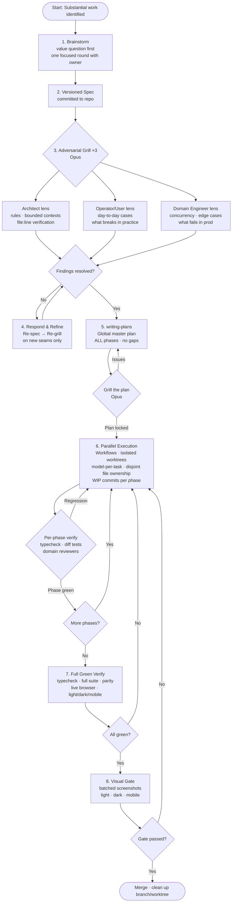

# Forge Methodology

> A disciplined pipeline for substantial software work with AI agents.

**Forge** is a named workflow for AI-assisted software engineering. It structures work that's too important to improvise: new features, architectural changes, large refactors, and migrations. The short version: **spec → adversarial grill → global plan → parallel execution → green verify → visual gate**.

Forge is not a process for everything. One-liners and formatting go direct. Forge is for the work where getting the design wrong is expensive.

---

## Why Forge?

AI agents are fast. That speed is also a risk: they'll implement the wrong thing thoroughly. Forge front-loads the hard thinking so execution is mechanical:

- **Adversarial grill** catches wrong assumptions before code is written
- **Global master plan** eliminates mid-flight improvisation
- **Model-per-task** keeps cost proportional to difficulty
- **Continuous per-phase verify** catches regressions at phase N, not the PR of phase N+10
- **Hard multi-worker rules** prevent racing conditions between parallel agents

---

## Pipeline at a Glance



---

## Execution & Orchestration Layer (8 Rules)

Forge designs well. These rules optimize **cost and reliability** for parallel multi-agent execution.

| # | Rule | Key point |
|---|------|-----------|
| 1 | **Quota + tier scheduling** | Build an account ledger before executing. Heaviest work → highest tier. Checkpoint preventively at ~80% window, never reactively. Keep one account in reserve. |
| 2 | **File-ownership graph** | Each phase declares files it writes + depends on. Compute the parallelizable schedule; detect cross-cutting files upfront and assign one integrator. |
| 3 | **Continuous per-phase verify** | Each phase commit triggers cheap parallel verify (typecheck + diff tests + domain reviewers). Catch regressions at phase N, not phase N+10. |
| 4 | **Adaptive tiered grill** | Grill depth ∝ novelty × blast radius. First pass Sonnet; escalate to Opus only for disputed/architectural findings. |
| 5 | **Cheap orchestrator** | Routine coordination = scripted/Haiku/monitor. Opus only for rebalancing, arbitration, grill, critical review. |
| 6 | **Resume capsule + WIP commits** | Each workstream keeps a committed `state.md`. Sub-phase WIP commits prevent losing work when a session limit hits. |
| 7 | **Batched visual gate + stories** | All UI components get stories. Accumulate all surface screenshots into one gate queue; review many at once instead of stalling per PR. |
| 8 | **Phase granularity** | Each phase ≤ 1 reviewable commit / ~1-2h. Mark parallelizable vs serial in the plan (derived from the file-ownership graph). |

### Hard Multi-Worker Rules

- **1 worktree = 1 worker = 1 branch** — no exceptions.
- Verify a worker is dead by **PID and actual prompt**, not by naive `grep | wc`.
- Kill the whole process tree (parent shell + agent process + any build subprocesses).
- Launch headless with `--permission-mode acceptEdits` + explicit tool allowlist. **Never `--dangerously-skip-permissions`.**
- **Zero billable infra resources** without explicit approval.

---

## Cross-Cutting Principles

### ⭐ Model Per Task (most important cost control)

| Model | Use for |
|-------|---------|
| **Haiku** | Trivial / mechanical: one-liners, formatting, stubs |
| **Sonnet** | Executing closed plans, refactors, migrations, volume |
| **Opus** | Architecture, adversarial grill, arbitration, critical review |

No Opus where Sonnet performs equally well. Applies to every agent, including the orchestrator.

### ⭐ Scripts Before Tokens

Repetitive/mechanical/high-volume work → write a bash/python script or use `grep`/`rg`/`sed`/`jq`. Deterministic, fast, cheap. Reserve tokens for design, grill, and decisions.

### Reuse-First at Every Layer

Create reusable primitives before duplicating logic. Cross-cutting concerns (auth, API fetch, logging, errors, i18n) → one central point. Reuse is part of design, not an afterthought.

---

## Installation

### As a Claude Code Skill (recommended)

```bash
git clone https://github.com/davidgarciagordo/forge-methodology ~/.claude/skills/forge-methodology
```

Claude Code will pick up the skill automatically. Invoke it with the `Skill` tool using `skill: "forge-methodology"`.

### As a Project Rule

Copy `SKILL.md` into your project's rules directory:

```bash
cp ~/.claude/skills/forge-methodology/SKILL.md ~/.claude/rules/forge-methodology.md
```

Or copy directly from this repo:

```bash
curl -o ~/.claude/rules/forge-methodology.md \
  https://raw.githubusercontent.com/davidgarciagordo/forge-methodology/main/SKILL.md
```

---

## License

MIT — see [LICENSE](./LICENSE).
